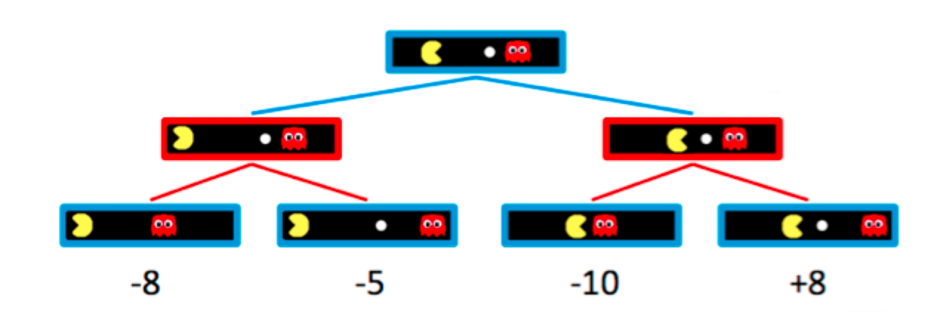
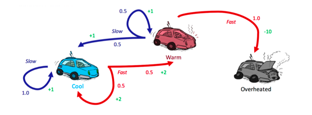
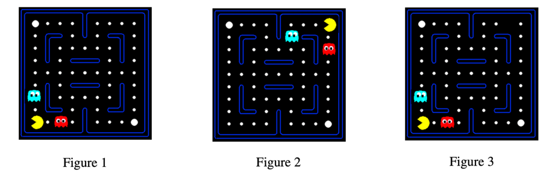

# CS188-AI导论

### [lab1 Search](https://inst.eecs.berkeley.edu/~cs188/sp23/projects/proj1/) 
A* search (backforward value + heuristic value) to address the problem of eating all the dots with consistency constraint.

### [lab2 Logic and Classical Planning](https://inst.eecs.berkeley.edu/~cs188/sp23/projects/proj2/)  
Use logic power to give pacman planning, localization, mapping and SLAM(localization and mapping simultaneously) ability!

### [lab3 Multi-Agent Search](https://inst.eecs.berkeley.edu/~cs188/sp23/projects/proj3/)
Use Minimax algorithm with Alpha-Beta pruning and Expectimax algorithm to cope with optimal ghost and suboptimal ghost(not always choose the best decisions e.g. random ghost) respectively. 

tips: because of computational constraints, Pacman didn't compute all situation, he instead use evaluation function to evaluate limited depth terminal state. 

### [lab4 MDPs and Q-learning](https://inst.eecs.berkeley.edu/~cs188/sp23/projects/proj4/)
### MDPs (markov decision processes)
Use value iteration algorithm to solve such MDPs problem(we prefer policy iteration than value iteration, because The convergence of policy tends to be much faster than the convergence of value)

### Q-learning and Approximate Q-learning
Use Q-learning and approximate Q-learning to train Pacman to get optimal policy.  

On training, Pacman use Epsilon-Greedy to exploration and exploitation. by the way, Exploration function
is better.

About approximate Q-learning, Q-learning just stores all Q-values for states, which is not particularly efficient given that most applications of reinforcement learning have several thousands or even millions of states.

when Pacman finish train on Figure 1 and meet Figure 3, Pacman doesn't know what to do because they are different state even if only 1 dot missing!  

So maybe we can more general: Pacman only need to know this is a bad state when the ghost is very close to me and there is no exit.

### [lab5 Ghostbusters(Bayes Nets)](https://inst.eecs.berkeley.edu/~cs188/sp23/projects/proj5/)
