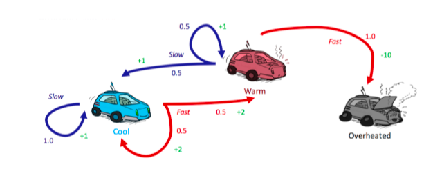

# CS188-AI导论

## lab1 Search  
A* search (backforward value + heuristic value) to address the problem of eating all the dots with consistency constraint.

## lab2 Logic and Classical Planning  
Use logic power to give pacman planning, localization, mapping and SLAM(localization and mapping simultaneously) ability!

## lab3 Multi-Agent Search
Use Minimax algorithm with Alpha-Beta pruning and Expectimax algorithm to cope with optimal ghost and suboptimal ghost(not always choose the best decisions e.g. random ghost) respectively. 

tips: because of computational constraints, Pacman didn't compute all situation, he instead use evaluation function to evaluate limited depth terminal state. 

## lab4 MDPs and Q-learning
### MDPs (markov decision processes)
Now, we'll make our model to account for another influencing factor - the dynamics of world itself !   
in other word, there are multiple possible successor state from an action(i.e. this action has inherent uncertainty, e.g. dealing card in poker).

such problems where the world poses a degree of uncertainty are known as **nondeterministic search problem**, and can be solved with models known as **Markov decision processes**.

Use value iteration algorithm to solve such MDPs problem(we prefer policy iteration than value iteration, because The convergence of policy tends to be much faster than the convergence of value)

### Q-learning

